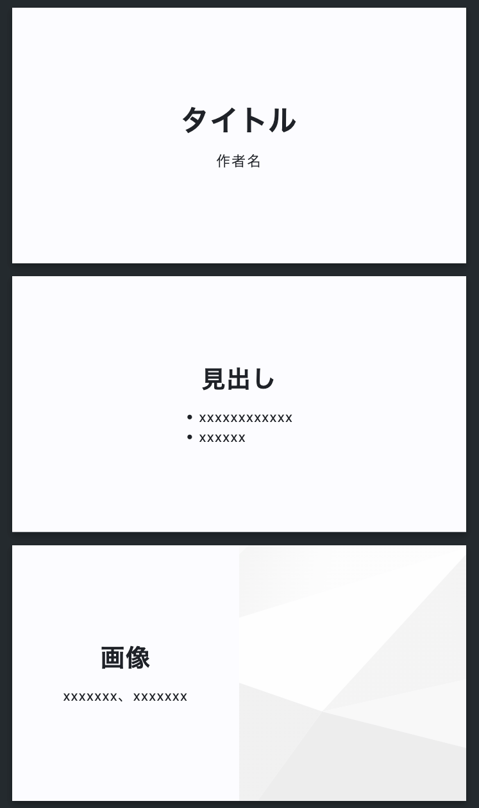
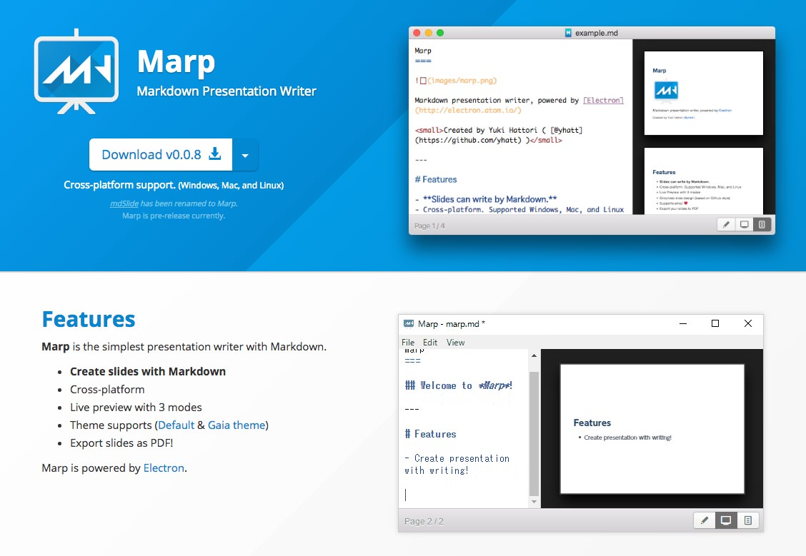
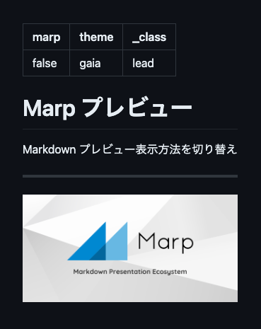
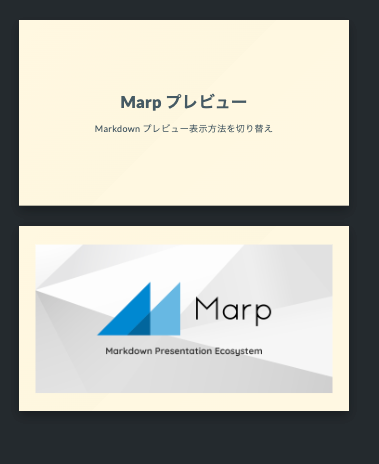
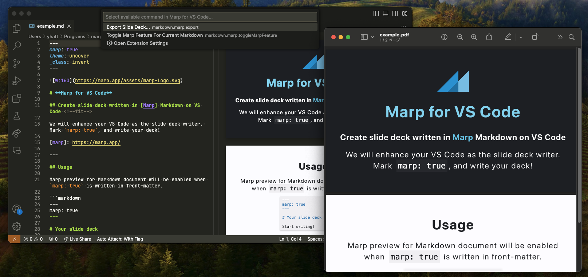
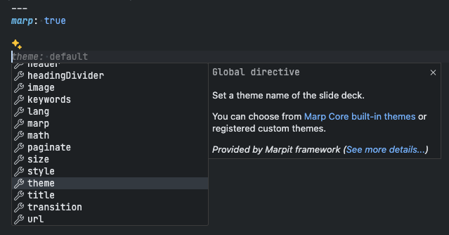
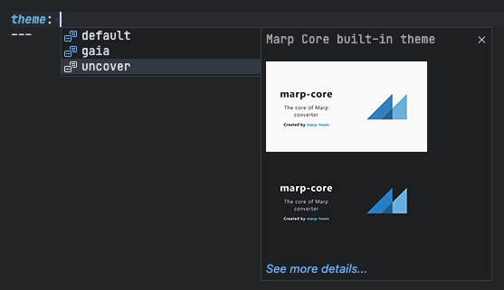
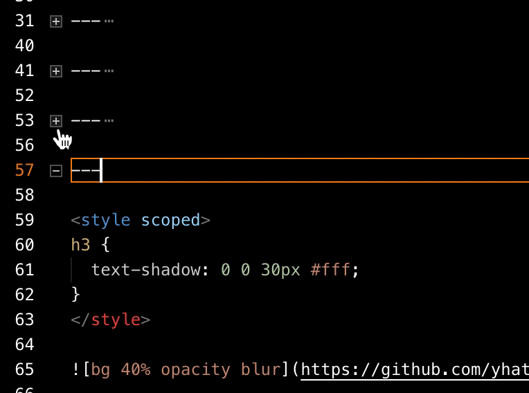

<!--
# Metadata
title: Marp for VS Code 拡張機能開発の舞台裏 - VS Code Conference Japan 2024
author: Yuki Hattori
description: Marp for VS Code は、プレゼンテーションを Markdown で作成できるオープンソースのエコシステム "Marp" を、VS Code 上で使用できる拡張機能です。VS Code の強力なエディタ機能に Marp を統合することで、プレゼンテーション執筆ワークフローの効率化を実現します。この発表では、 Marp の簡単な概要と、いかにして Marp が VS Code の採用に至ったか、そして実際の拡張機能の設計や、拡張機能開発にあたって注意しているポイントなどを、順を追ってご紹介いたします。
keywords: Marp, Marp for VS Code, VS Code, VS Code extension, 拡張機能, プレゼンテーション, Markdown, エコシステム
lang: ja

# Slide styling
theme: vscode-conf
_class: lead title
paginate: true
_paginate: false
transition: fade 250ms

style: |
  header em { font-style: normal; view-transition-name: header; }
  header strong { font-weight: inherit; view-transition-name: header2; }
  header:not:has(em) { view-transition-name: header; }

  /* Diagram */
  section.marp-diagram ul {
    display: flex;
    flex-direction: column-reverse;
    list-style: none;
    padding: 0;
    clip-path: polygon(25% 0, 75% 0, 100% 100%, 0 100%);
    width: 75%;
    margin: 0 auto;
  }

  section.marp-diagram li {
    background: var(--blue);
    padding: 0.6rem;
    margin: 0.2rem 0;
    color: var(--white);
    text-align: center;
    font-size: 0.7rem;
  }

  section.marp-diagram li em {
    font-style: normal;
    text-decoration: underline;
  }

  section.marp-diagram li strong {
    font-size: 1rem;
    display: block;
  }
-->

# **Marp for VS Code**<br />拡張機能開発の舞台裏

## Yuki Hattori

2024-04-20 &mdash; VS Code Conference Japan 2024

---

<!-- _class: lead -->

<style scoped>ul { list-style: none; padding: 0; }</style>


## Yuki Hattori (服部 雄輝)

フロントエンドエンジニア
Marp メンテナー

- &ensp;|&ensp;株式会社 YAGO
- &ensp;|&ensp;[@y_hatt](https://x.com/y_hatt)
- &ensp;|&ensp;[@yhatt](https://twitter.com/yhatt)

---

<style scoped>a { color: currentcolor; }</style>

## 目次

- [Marp とは？](#about-marp)
- [なぜ VS Code なのか？](#why-vscode)
- [拡張機能の機能・設計](#structure)
- [開発のポイント](#points)

---

<!-- _class: lead -->

<style scoped>
h1 {
  view-transition-name: header;
  display: flex;
  align-items: center;
  margin: 0 auto;
}
</style>

#  とは？

<a name="about-marp"></a>

---

<!-- _class: lead -->
<!-- header: "_Marp とは？_" -->

# Markdown で<br />プレゼンスライドを書く<br />エコシステム

---

<!-- _class: lead -->

```markdown
<!-- theme: uncover -->

# タイトル

作者名

---

## 見出し

- xxxxxxxxxxxx
- xxxxxx

---

## 画像

xxxxxxx、xxxxxxx


```



---

<!-- header: "" -->
<!-- _class: lead -->

<style scoped>section { padding-bottom: 0; }</style>

## **Marp for VS Code** ＝ <br />Marp を VS Code で使うための拡張


---

<style scoped>
h1 { view-transition-name: header; }
</style>

<!-- _class: lead -->

# なぜ VS Code なのか？

<a name="why-vscode"></a>

---

<!-- _class: lead -->
<!-- header: "_なぜ VS Code なのか？_" -->

# 👉 エディターとしての<br />高い機能性・拡張性

---

## **2015**: 初代 Marp



---

## **2015**: 初代 Marp


### オールインワンアプリの限界

<!-- prettier-ignore-start -->

* ユーザーの要望が多種多様
* 「エディターとしての機能性」も求められるように
* 「Markdownでスライドを書く」という命題にフォーカスできなくなりそう

<div data-marpit-fragment>

#### 👉 要素を分解し、モジュラーなエコシステムとしての方向性を模索

</div>

<!-- prettier-ignore-end -->

---

<!-- _class: marp-diagram -->

## **2018**: 新生 Marp <small>(Marp Next)</small>

複数のパーツから構成されるエコシステム

- **フレームワーク** (Marpit framework)
- **コア** (Marp Core)
- **ツール** (コマンドラインツール / GUI ツール)

---

## Marp CLI (コマンドラインツール)


---

## GUI ツールに求められるもの

<!-- prettier-ignore-start -->

* **初代 Marp と同等の体験**
  - スライドプレビュー＆エクスポート
* **エディターの機能性・拡張性**
  - ユーザー好みのエディター環境にできる
* **開発・保守の容易さ**
  - GUI はコアのフロントエンドに徹したい

<!-- prettier-ignore-end -->

---

<!-- header: "" -->


---

<!-- _footer: "[https://github.com/yhatt/marp/issues/118](https://github.com/yhatt/marp/issues/118)" -->


---

<style scoped>
h1 { view-transition-name: header; }
</style>

<!-- _class: lead -->

# 拡張機能の機能・設計

<a name="structure"></a>

---

<!-- header: "_拡張機能の機能・設計_" -->
<!-- _class: lead -->

## Marp for VS Code の機能

- Marp プレビュー
- エクスポート機能
- Markdown 言語機能の拡張


---

<!-- _class: lead -->

# Marp プレビュー

<style scoped>
h1 { view-transition-name: header2; }
</style>

---

<!-- header: "_拡張機能の機能・設計_ > **Marp プレビュー**" -->
<!-- _class: lead -->

<style scoped>
  code {
    --highlight-line-begin: 2;
    --highlight-lines: 1;
    --highlight-line-color: rgb(255 255 255 / 20%);
  }
</style>



```
---
marp: false
theme: gaia
_class: lead
---

# Marp プレビュー

Markdown プレビュー表示方法を切り替え

---


```

---

<!-- _class: lead -->

<style scoped>
  code {
    --highlight-line-begin: 2;
    --highlight-lines: 1;
  }
</style>



```
---
marp: true
theme: gaia
_class: lead
---

# Marp プレビュー

Markdown プレビュー表示方法を切り替え

---


```

---

### Markdown Extension


<!-- _footer: "https://code.visualstudio.com/api/extension-guides/markdown-extension" -->

---

<!-- _class: lead -->
<!-- _footer: "https://code.visualstudio.com/api/extension-guides/markdown-extension" -->

```json
"contributes": {
  "markdown.markdownItPlugins": true
}
```

```typescript
import type { ExtensionContext } from 'vscode'

export function activate(context: ExtensionContext) {
  return {
    extendMarkdownIt(md: any) {
      return md.use(require('markdown-it-plugin'))
    },
  }
}
```

<style scoped>
  pre:nth-of-type(1) code {
    --highlight-line-begin: 2;
    --highlight-lines: 1;
  }
  pre:nth-of-type(2) code {
    --highlight-line-begin: 5;
    --highlight-lines: 3;
  }
</style>

---

### 設計

`marp: true` を検出したら、処理を Marp の markdown-it エンジンに移譲

```typescript
extendMarkdownIt(md: any) {
  const { parse: originalParse } = md

  md.parse = (markdown: string, env: any) => {
    if (detectMarpFromMarkdown(markdown)) { // marp: true を検出したら…
      md.marp = new Marp()
      return md.marp.markdown.parse(markdown, env) // Marp の markdown-it エンジンに移譲　
    } else {
      md.marp = false
      return originalParse.call(md, markdown, env) // そうでないなら、元々のパース処理を実行
    }
  }
}
```

<style scoped>
  code {
    --highlight-line-begin: 5;
    --highlight-lines: 3;
  }
</style>

---

<!-- _class: lead -->
<!-- header: "_拡張機能の機能・設計_" -->

# エクスポート機能



<style scoped>
h1 { view-transition-name: header2-alt; }
</style>

---

<!-- header: "_拡張機能の機能・設計_ > **エクスポート機能**" -->
<!-- _footer: "https://github.com/marp-team/marp-cli#api-experimental" -->

<style scoped>
header strong { view-transition-name: header2-alt; }
</style>

## 設計

拡張機能に埋め込まれた Marp CLI を使用

```typescript
import { marpCli } from '@marp-team/marp-cli'

async exportCommand(doc: TextDocument, outputUri: Uri) {
  const input = await createWorkFile(doc)
  const output = uri.fsPath // 保存先のパス

  await marpCli([input, '-o', output]) // `marp input.md -o [保存先のパス]` を呼出　
}
```

---

<!-- _class: lead -->
<!-- header: "_拡張機能の機能・設計_" -->

# Markdown 言語機能の拡張

- ディレクティブの補完
- コードハイライト＆ホバーヘルプ
- リンター
- Markdown アウトライン拡張

<style scoped>
h1 { view-transition-name: header2; }
</style>

---

<!-- header: "_拡張機能の機能・設計_ > **Markdown 言語機能の拡張**" -->

## ディレクティブの補完

- スライドの設定を行う Marp 記法
- `Ctrl+Space` で補完

<div class="centered">

&emsp;

</div>

---

## コードハイライト＆ホバーヘルプ

- 認識されたディレクティブを強調表示
- ホバーで簡単なヘルプと、ドキュメントへのリンクを表示


---

## リンター

- 非推奨のディレクティブや、エラーを検知してハイライト
- 一部は 💡 から自動修正可能


---

## Markdown アウトライン拡張

- アウトラインサイドバーでスライドページを認識
- スライドページ単位のコード折りたたみ

<div class="centered">

&emsp;

</div>

---

## 設計

- **Programmatic Language Features**
  - Markdown 向けの Language Server は当時まだ無かった
  - 👉 VS Code API で愚直に拡張

```typescript
// 例: 補完機能の提供
vscode.languages.registerCompletionItemProvider('markdown', {
  async provideCompletionItems(doc, pos) {
    const themeCompletionItem = new vscode.CompletionItem('theme')
    themeCompletionItem.documentation = 'Set the theme name of slide deck'

    return [themeCompletionItem] // 実際には、ドキュメントやカーソル位置で、補完候補をフィルタリングする必要がある
  },
})
```

<!-- _footer: "https://code.visualstudio.com/api/language-extensions/programmatic-language-features" -->

---

<!-- _header: "" -->

<style scoped>
h1 { view-transition-name: header3; }
</style>

<!-- _class: lead -->

# 開発のポイント

<a name="points"></a>

---

<!-- _class: lead -->
<!-- header: "_開発のポイント_" -->

# 👉 **小さな拡張**で<br />VS Code の進化に寄り沿う

<style scoped>
header em { view-transition-name: header3; }
</style>

---

## **2018**: + Visual Studio Live Share

👉 Marp Markdown を共同で編集


<!-- _footer: "https://visualstudio.microsoft.com/ja/services/live-share/" -->

---

## **2019**: + Remote Development

👉 コンテナーや WSL 上での編集・エクスポートに対応


<!-- _footer: "https://marketplace.visualstudio.com/items?itemName=ms-vscode-remote.vscode-remote-extensionpack" -->

---

## **2021**: + Workspace Trust

👉 強化されたセキュリティモデルをフォロー


<!-- _footer: "https://code.visualstudio.com/blogs/2021/07/06/workspace-trust" -->

---

## **2021**: + github.dev / vscode.dev

👉 Web Extension に対応、ブラウザ上で Marp の編集/プレビューが可能に


<!-- _footer: "https://code.visualstudio.com/api/extension-guides/web-extensions"  -->

---

## **2022**: + Markdown Language Server / Service

👉 強化が進む Markdown 言語機能の恩恵を受けられる


<!-- _footer: "https://code.visualstudio.com/blogs/2022/08/16/markdown-language-server" -->

---

## **2022**: + GitHub Copilot

👉 スライドの執筆を AI で支援


---

<!-- _class: lead -->
<!-- header: "" -->
<!-- _transition: fade -->

# Marp for VS Code + **???** = 🚀🚀🚀 <!--fit-->

<style scoped>
h1 { view-transition-name: lead; }
</style>

---

<!-- _class: lead -->
<!-- _paginate: hold -->
<!-- _transition: fade-out -->

# Marp for VS Code + **???** = 🚀🚀🚀 <!--fit-->

小さな拡張で VS Code のエコシステムを活かし、価値を最大化

<style scoped>
h1 { view-transition-name: lead; }
</style>

---

<!-- header: "" -->
<!-- _class: lead -->

<style scoped>
  section { padding-bottom: 0; }
  p { font-size: 0.7rem; }
</style>

## &ensp;Marp for VS Code

https://marketplace.visualstudio.com/items?itemName=marp-team.marp-vscode


